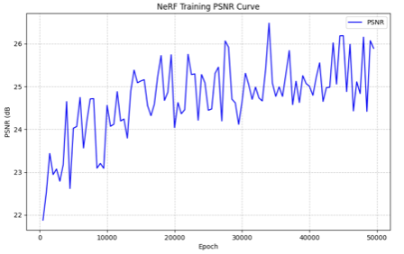
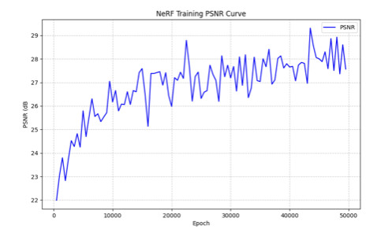
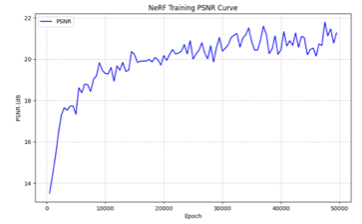
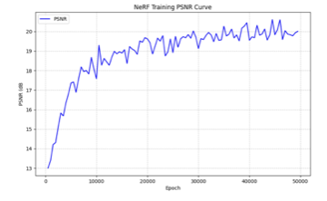
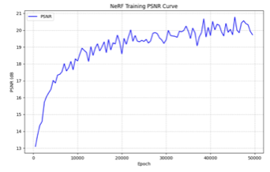
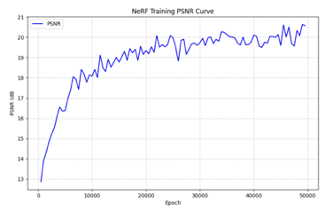
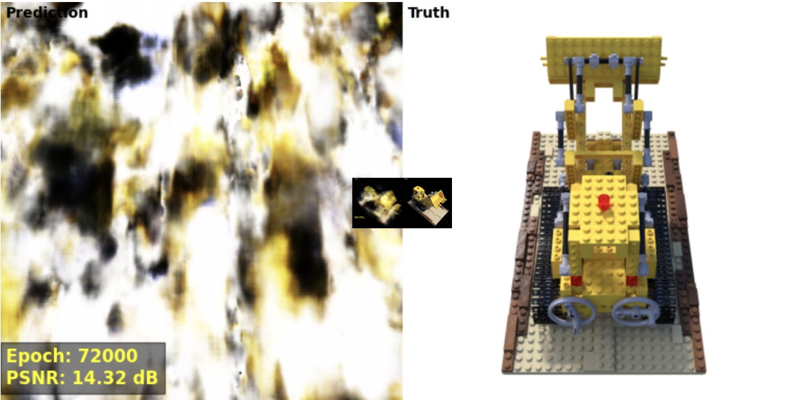

# NeRF From Scratch Study

이 레포지토리는 **NeRF (Neural Radiance Fields)** 논문을 읽고 PyTorch를 사용하여 **직접 구현** 한 프로젝트입니다.
Volume Rendering의 핵심 원리를 이해하고, original NeRF를 구현했으며, GPU가 없이도 비교적 빠르게 학습 후, 결과물을 볼 수 있는 **"Tiny NeRF"** 에 대한 구현과 다양한 **비교 실험(Ablation Study)** 을 담고 있습니다.

> **핵심 포인트:** 입력 특징(Feature), 모델 깊이(Depth), 샘플링 수(Sampling rates), 학습률(Learning rate) 등이 3D 복원 품질에 미치는 영향을 체계적으로 실험하고 분석했습니다.

---

## 1. 소개 (Introduction)
**NeRF**는 소수의 2D 이미지만으로 연속적인 3D 공간 함수를 학습하여 새로운 시점의 이미지를 합성하는 기술입니다.
- **입력 (Input):** 5D 좌표 (공간 위치 $(x, y, z)$ + 보는 방향 $(\theta ,\phi )$ )
- **출력 (Output):** 해당 위치의 색상 $(r, g, b)$ 및 투명도/밀도 $(\sigma)$
- **방법 (Method):** FCN인 MLP를 사용하여 공간을 표현

---

## 2. 구현: Original vs. Tiny

저는 논문의 스펙을 따른 **Original NeRF**와 이를 경량화한 **Tiny NeRF** 두 가지 버전을 모두 구현하여 성능과 자원 효율성을 비교했습니다.

### 🔍 분석: 왜 결과 품질에 차이가 나는가?
핵심 로직(Volume Rendering 적분식, 계층적 샘플링)은 동일하지만, 모델의 용량(Capacity)과 밀도(Density) 차이로 인해 결과물에 큰 차이가 발생했습니다.
또한 original NeRF를 사용하게 됐을 때는 800 $\times$ 800의 이미지를 사용하지만, Tiny_NeRF는 100 $\times$ 100의 이미지를 사용합니다. 비교적 학습할 양이 적어서, 더 빠른 학습도 가능합니다.

| 특징 | Original NeRF (논문 스펙) | Original NeRF (나의 구현) | Tiny NeRF (나의 구현) | 이유 (reason) |
| :--- | :--- | :--- | :--- | :--- |
| **모델 용량 (Capacity)** | 8 layers, 256 hidden units | 8 layers, 128 hidden units | 2 or 4 layers, 128 hidden units | Personal한 환경에서 돌릴 때, OOM이 너무 쉽게 남. Tiny는 학습이 빠르지만 고주파(High-frequency) 디테일 표현이 부족함. |
| **Ray 배치 크기** | 4,096 rays | 512 rays | 1,024 rays | 이 또한 OOM 고려. Ray 밀도가 낮으면 앨리어싱(Aliasing)이 발생하고 형상이 무너짐 |
| **샘플링 포인트 수** | 64 (Coarse) + 128 (Fine) | 128(only coarse) | 64 ~ 128 (Single pass) | coarse-to-fine 방식은 inverse transform sampling에 대해 더 공부하고 직접 구현하고 싶었음. coarse만 사용하는 것을 보완하기 위해, sample 개수를 기존 coarse 대비 올림. 샘플 수가 적으면 빈 공간 계산이 부정확해져 안개 낀 듯한 아티팩트 발생 |

---

## 3. 실험 및 분석 (Experiments & Ablation Studies) 📊

Tiny NeRF 아키텍처에서 최적의 성능을 끌어내기 위해 다양한 조건으로 비교 실험을 수행했습니다.

### 3-1. 입력 특징 비교: Positional Encoding (PE) vs. PE + Raw Input
고주파 특징인 PE 값 외에, 원본 $(x, y, z)$ 좌표를 함께 넣어주는 것이 유리할까?
논문에서는 원본값을 넣지 않는 것으로 표기했습니다. 하지만, 여러 실험을 거치다가, PE만 넣는 경우에, 이미지가 주기성을 보임을 확인했습니다.
* **가설:** 원본 좌표(Raw Input)를 함께 주면 모델이 전체적인 기하학적 위치(Low-frequency)를 더 빨리 파악할 것이다.
* **결과:** `PE + Raw Input`을 사용했을 때 초기 수렴 속도가 훨씬 빠르고, 형상이 안정적으로 잡힘을 확인했습니다.

| PE Only (기존 방식) | PE + Raw Input (x, y, z 추가) |
| :---: | :---: |
|  |  |
|  |  |
| *초기 수렴이 느리고 불안정함* | *빠른 수렴 및 정확한 형상 파악* |

### 3-2. 네트워크 깊이 비교: 2 Layers vs. 4 Layers
MLP의 깊이(Capacity)가 3D 복원 품질에 미치는 영향.
* **관찰:** 2 Layer는 복잡한 3D 형상을 표현하기에는 조금 아쉽고, 4 layer와 비교했을 때 흐릿하게(Blurry) 나옴. 4 Layer 정도가 속도와 품질의 균형이 가장 좋음.

| 2 Layers (얕은 모델) | 4 Layers (깊은 모델) |
| :---: | :---: |
|  |  |

### 3-3. 샘플링 전략: Ray당 샘플 수 ($N_c$)
하나의 광선(Ray) 위에서 몇 개의 점을 샘플링할 것인가?
* **$N_c=64$** 
* **$N_c=128 :$** 두 배로 ray를 늘리면, 해상도는 더 좋아질 것인가?
  **이 정도는 큰 차이가 없었습니다** 

| 샘플 수 적음 (Low Samples) | 샘플 수 많음 (High Samples) |
| :---: | :---: |
|  |  |

### 3-4. 하이퍼파라미터 튜닝: 학습률 (Learning Rate)
* **LR = 5e-3:**
* **LR = 1e-4:** LR을 2배 늘렸을 때, 학습 속도는 어떻게 달라질 것인가?
  **이 정도는 큰 차이가 없었습니다** 

| LR = 5e-3 | LR = 1e-4 |
| :---: | :---: |
|  |  |

---

## 4. Original NeRF 구현 시도 및 한계 (Memory Constraint)
하드웨어 제약(Single GPU) 하에서 **Original NeRF** 아키텍처 학습을 시도해 보았습니다. 논문에 표기된 대로, Raw Input 없이 **Positional Encoding만 사용**하여 학습을 진행했습니다.
* **관찰:** Skip Connection이나 Raw Input의 보조 없이 깊은 네트워크를 학습시키는 것은 매우 어려웠으며, 제한된 Epoch 내에서 Local Minima(하얗게 나오는 현상 등)에 빠지는 것을 확인했습니다. 구현한 로직 자체에 문제가 있는 것인지 확인하기 위해, Dataset 하나 하나의 크기만 줄여서 사용하는, Tiny_NeRF로 변경해서, 동일한 로직을 수행했는데 잘 나오는 것을 보고, 로직의 문제가 아님을 확인했습니다.
* **학습 데이터 크기:** 학습 데이터의 크기도 영향을 줍니다. 큰 이미지의 가운데에 있는 작은 이미지가 Tiny_NeRF의 학습 데이터 이미지 크기이고, 각각 실제 크기만큼 scaling해놓은 것입니다. 이처럼, 작은 이미지로는 personal한 환경에서도 학습 가능했지만, 큰 이미지는 GPU를 사용하지 않고는 긴 시간이 소요됩니다.

  
  
<em>Original NeRF 아키텍처 학습 시도 결과 (PE Only)</em>

---

## 5. 학습 노트 및 참고 자료 (Study Notes & References) 📚

* **수식 유도 및 논문 리뷰:** * [나의 노션 페이지 (Click Here)](https://www.notion.so/3D-CV-NeRF-study-2a6ff2baaf92805cb382f50ca30436ce?source=copy_link) - NeRF 논문 읽고 학습, 그리고 3D reconstruction 공부한 것을 올리는 곳.
* **Original Paper:** * [NeRF: Representing Scenes as Neural Radiance Fields for View Synthesis (ECCV 2020)](https://www.matthewtancik.com/nerf)
